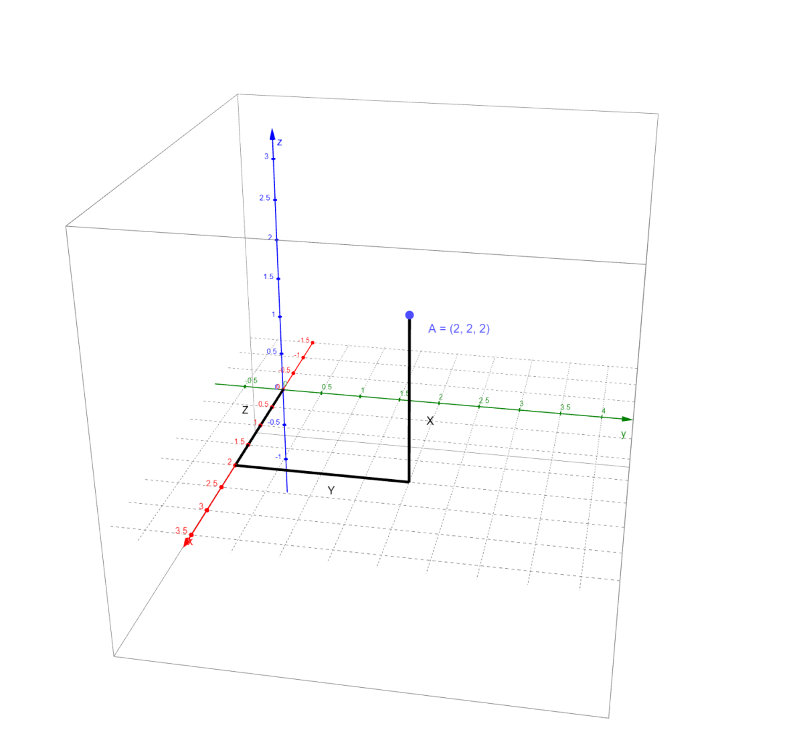
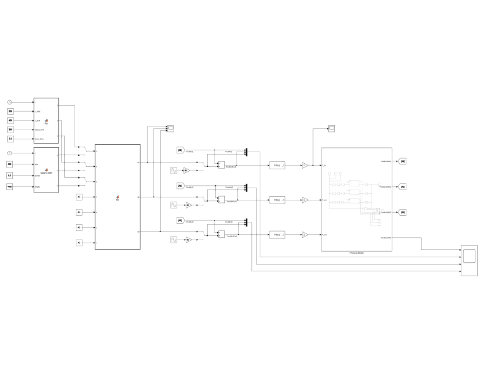
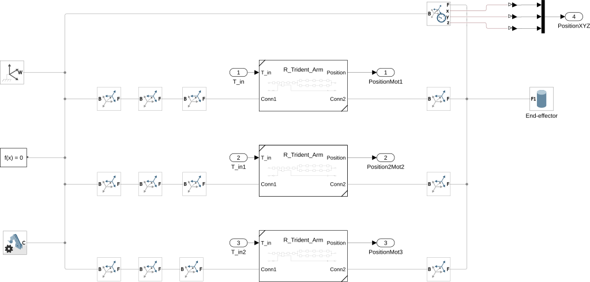
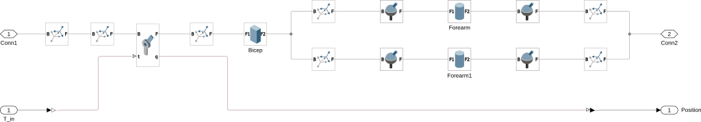
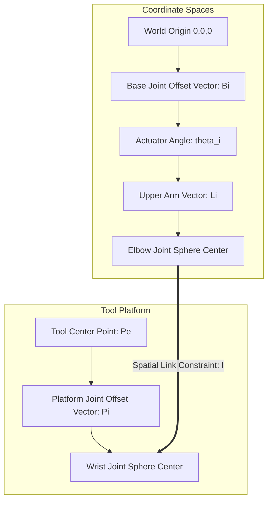
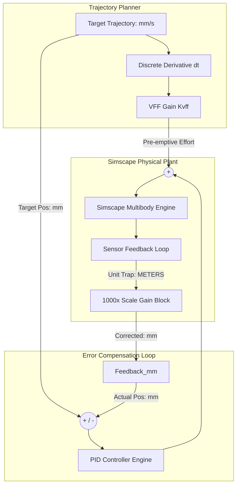

# 01. Mathematical Kinematics & Control Optimization

To start, we need to establish some groundwork. A standard machine uses a Cartesian motion system, where a movement in X requires only the corresponding axis to move to achieve a translation. While this can become complicated if different coordinate systems are used for the "World" and the Effector, that remains an edge case.

<div align="center">
<figure>
    
    <figcaption> Example of a cartesian motion system.</figcaption>
</figure>
</div>

Non-Cartesian systems, on the other hand, require mathematical computation to determine movement. A simple example is a two-link arm: a stick pivoting around a point with a second stick pivoting at its end. In this setup, you can reach any point in a 2D space. By knowing the angles of the two joints, you can calculate the coordinates of the end effector on the second link (SCARA).
This is the foundation of a Non-Cartesian system. It allows movement in 2D or 3D space but requires knowing the relative position of every part to extract the XYZ coordinates.

Delta systems are a subcategory where the "tool" (effector) is positioned in 3D space using three linkages that move along the same primary axes. By combining the movement of these three linkages, the effector's location is determined.
Rotary Deltas are a further sub-specialization, where the angle of a "bicep" and the lengths of the linked rods
dictate the final position.

## Spatial Kinematics Foundation

The Revolute-Input Delta Robot kinematics must be resolved using intersecting spheres in 3D coordinate space.

### The Vector Loop Equation

The primary equation for each of the three independent kinematic chains ($i = 1, 2, 3$) is modeled as:

$$\vec{B}_i + \vec{L}_i + \vec{l}_i = \vec{P}_e + \vec{P}_i$$

Where:

* $\vec{B}_i$: Vector from world coordinate origin to base joint $i$.
* $\vec{L}_i$: Vector representing the upper arm (bicep).
* $\vec{l}_i$: Vector representing the parallel spatial link (forearm pair).
* $\vec{P}_e$: Position vector of the tool-center point (TCP) end-effector.
* $\vec{P}_i$: Offset vector of joint attachment on the moving platform.

### Physical Design Constraints Matrix

* **Base Triangle Inscribed Radius ($s_B$):** 80 mm
* **Moving Platform Radius ($s_P$):** 35 mm
* **Upper Arm Length ($L$):** 150 mm
* **Lower Spatial Link Length ($l$):** 335 mm

---

## 2. Simulink modeling

To help with the complex mathematics used in this type of motion system a matlab project was created.
The systeme was split into multiple parts to aide in debugging. The parts are as followed 

* Main System View
  * Path generation
    * Random Pick and Place path generation.
    * Square path generation.
    * Circular path generation
  * Inverse Kinematics block translating ${x,y,z}$ coordinates to angles ${ \theta_1 , \theta_2 , \theta_3 }$.
  * PID
    * $PID_1$
    * $PID_2$
    * $PID_3$
  * Physical Model
    * Phsical-linkages$_1$
    * Phsical-linkages$_2$
    * Phsical-linkages$_3$
  * Forward Kinematics
  * Scopes

<div align="center">
<figure>
    
    <figcaption> MatLab Simulink model of the delta kinematics</figcaption>
</figure>
</div>

<div align="center">
<figure>
    
    <figcaption> MatLab Simscape model of the over all physical model linkages</figcaption>
</figure>
</div>

<div align="center">
<figure>
    
    <figcaption> MatLab Simscape model of the phsical linkages</figcaption>
</figure>
</div>

---

## 3. Path Tracking Dynamics & Z-Axis Bowing Correction

During fast linear XY translations, the end-effector can experience structural "bowing" along the Z-axis. This path error occurs because pure PID feedback loops react *after* tracking errors manifest.

### Velocity Feed-Forward (VFF)

To resolve this, the commanded trajectory velocity is passed through an active derivative block, scaled, and added directly to the control effort output:

```text
Commanded Pos ──> [Trajectory Planner] ──> Joint Angle ──> (+) ──> [Servo Drive]
                                               │           ^
                                               └──> [VFF] ─┘

```

Reference Control ParametersProportional Gain ($K_p$): 40
Integral Gain ($K_i$): 1.5
Derivative Gain ($K_d$): 4
Derivative Filter Coefficient ($N_d$): 100
Feed-Forward Coefficient ($K_{\text{vff}}$): 0.85

## Kinematic Architecture Flowchart



Additional Deep-Dive Content to Paste Into Section 01:



# Mathematical Kinematics and Coordinate Frameworks for Rotary Delta Robot

This document establishes the geometric foundations, coordinate reference systems, and algebraic formulations required to model, simulate, and control the parallel kinematics engine of the high-speed Rotary Delta robot based on your custom physical dimensions.

Traditional 2D simplification methods (such as the law of cosines projected onto independent swinging planes) introduce severe kinematic warping when the robot transitions along its operational $X/Y$ boundaries. This warping occurs because the lower parallel linkages angle outwards into the 3D workspace domain. To guarantee micro-step tracking precision and eliminate path distortion, true spatial intersections are resolved algebraically using vector loop closures and intersecting sphere equations.

---

## System Geometry and Reference Frames

The architecture features a stationary upper platform (fixed base) and a translating lower platform (moving end-effector). Three symmetric closed-loop chains connect these platforms. Each chain consists of an actuated proximal link (bicep $L$) driven by a direct-drive servomotor and an unactuated parallel distal link (forearm parallelogram $l$).

### Coordinate Frame Assignments

* **Fixed Base Frame $\{B\}$:** The origin $O$ is positioned precisely at the planar center of the base platform. The $+Z_B$ axis points vertically upward, perpendicular to the base plane. The $+Y_B$ axis projects orthogonally toward the mid-point of the segment connecting revolute joint joints $B_2$ and $B_3$, forcing the first motor axis ($B_1$) to lie along the negative $Y_B$ axis.
* **Moving Platform Frame $\{P\}$:** The origin $P$ sits at the planar center of the moving end-effector platform. Because the parallelogram four-bar mechanisms eliminate all rotational degrees of freedom, the moving platform reference frame remains perfectly parallel to the fixed base frame across the entire reachable workspace ($[R_P^B] = I_3$).

### System Parameter Matrix

The following dimensional properties define your physical hardware build used for structural simulation, kinematic calculation, and control loop tuning:

| Variable | Mechanical Description | Value (mm) |
| :--- | :--- | :--- |
| $R_B$ | Base Pivot Circle Radius (Center to Motor Axis) | $80\text{ mm}$ |
| $R_P$ | End-Effector Radius (Center to Joint Axis) | $35\text{ mm}$ |
| $L$ | Upper Proximal Arm Length (Bicep) | $150\text{ mm}$ |
| $l$ | Lower Distal Arm Length (Forearm Parallelogram) | $335\text{ mm}$ |

---

## Vector Loop Closure Equations

For each of the independent arms ($i = 1, 2, 3$), a closed vector loop maps the geometric path from the central base origin to the tool center point (TCP) $P_e^B = [x, y, z]^T$:

$$\vec{B}_i^B + \vec{L}_i^B + \vec{l}_i^B = \vec{P}_e^B + [R_P^B]\vec{P}_i^P$$

Given that the orientation is constrained to translation-only ($[R_P^B] = I_3$), the vector equation simplifies to:

$$\vec{l}_i^B = \vec{P}_e^B + \vec{P}_i^P - \vec{B}_i^B - \vec{L}_i^B$$

### Fixed Base Angular Layout

The positions of the three base joints $\vec{B}_i^B$ are spaced symmetrically at $120^\circ$ intervals around the $Z_B$ axis at radius $R_B = 80\text{ mm}$:

$$\vec{B}_1^B = \begin{bmatrix} 0 \\ -R_B \\ 0 \end{bmatrix}, \quad \vec{B}_2^B = \begin{bmatrix} R_B\cos(30^\circ) \\ R_B\sin(30^\circ) \\ 0 \end{bmatrix}, \quad \vec{B}_3^B = \begin{bmatrix} -R_B\cos(30^\circ) \\ R_B\sin(30^\circ) \\ 0 \end{bmatrix}$$

Substituting $R_B = 80$:

$$\vec{B}_1^B = \begin{bmatrix} 0 \\ -80 \\ 0 \end{bmatrix}, \quad \vec{B}_2^B = \begin{bmatrix} 40\sqrt{3} \\ 40 \\ 0 \end{bmatrix}, \quad \vec{B}_3^B = \begin{bmatrix} -40\sqrt{3} \\ 40 \\ 0 \end{bmatrix}$$

### Moving Platform Connection Layout

The lower connection points $\vec{P}_i^P$ mapping the parallel joint attachments on the end-effector are defined relative to frame $\{P\}$ at radius $R_P = 35\text{ mm}$:

$$\vec{P}_1^P = \begin{bmatrix} 0 \\ -R_P \\ 0 \end{bmatrix}, \quad \vec{P}_2^P = \begin{bmatrix} R_P\cos(30^\circ) \\ R_P\sin(30^\circ) \\ 0 \end{bmatrix}, \quad \vec{P}_3^P = \begin{bmatrix} -R_P\cos(30^\circ) \\ R_P\sin(30^\circ) \\ 0 \end{bmatrix}$$

Substituting $R_P = 35$:

$$\vec{P}_1^P = \begin{bmatrix} 0 \\ -35 \\ 0 \end{bmatrix}, \quad \vec{P}_2^P = \begin{bmatrix} 17.5\sqrt{3} \\ 17.5 \\ 0 \end{bmatrix}, \quad \vec{P}_3^P = \begin{bmatrix} -17.5\sqrt{3} \\ 17.5 \\ 0 \end{bmatrix}$$

### Proximal Arm Joint Position

The bicep vector $\vec{L}_i^B$ is defined by the angular variables $\vartheta = [\theta_1, \theta_2, \theta_3]^T$, representing the motor rotation angles measured relative to the horizontal base plane:

$$\vec{L}_1^B = \begin{bmatrix} 0 \\ -L\cos\theta_1 \\ -L\sin\theta_1 \end{bmatrix}, \quad \vec{L}_2^B = \begin{bmatrix} L\cos\theta_2\cos(30^\circ) \\ L\cos\theta_2\sin(30^\circ) \\ -L\sin\theta_2 \end{bmatrix}, \quad \vec{L}_3^B = \begin{bmatrix} -L\cos\theta_3\cos(30^\circ) \\ L\cos\theta_3\sin(30^\circ) \\ -L\sin\theta_3 \end{bmatrix}$$

Substituting $L = 150$:

$$\vec{L}_1^B = \begin{bmatrix} 0 \\ -150\cos\theta_1 \\ -150\sin\theta_1 \end{bmatrix}, \quad \vec{L}_2^B = \begin{bmatrix} 75\sqrt{3}\cos\theta_2 \\ 75\cos\theta_2 \\ -150\sin\theta_2 \end{bmatrix}, \quad \vec{L}_3^B = \begin{bmatrix} -75\sqrt{3}\cos\theta_3 \\ 75\cos\theta_3 \\ -150\sin\theta_3 \end{bmatrix}$$

---

## Inverse Spatial Kinematics

The inverse kinematics problem calculates the required joint angles $\theta_i$ for a given tool coordinate $P_e^B = [x, y, z]^T$. Because the mechanical constraint locks each forearm parallelogram to a constant distance, the norm of the distal vector must always equal $l$ ($\|\vec{l}_i^B\|^2 = l^2$).

Substituting your vector definitions into the length constraint yields three independent scalar equations:

$$E_i\cos\theta_i + F_i\sin\theta_i + G_i = 0 \quad (i = 1, 2, 3)$$

Where the geometric constant terms for your specific dimensions ($L=150, l=335, R_B=80, R_P=35$) simplify to:

* **Arm 1:**
  $$E_1 = 2L(y + R_B - R_P) = 300(y + 45)$$
  $$F_1 = 2zL = 300z$$
  $$G_1 = x^2 + y^2 + z^2 + (R_B - R_P)^2 + L^2 - l^2 + 2y(R_B - R_P)$$
  $$G_1 = x^2 + y^2 + z^2 + 90y - 87700$$

* **Arm 2:**
  $$E_2 = -150\left(\sqrt{3}x + y - 45\right)$$
  $$F_2 = 300z$$
  $$G_2 = x^2 + y^2 + z^2 - 45\sqrt{3}x - 45y - 87700$$

* **Arm 3:**
  $$E_3 = 150\left(\sqrt{3}x - y + 45\right)$$
  $$F_3 = 300z$$
  $$G_3 = x^2 + y^2 + z^2 + 45\sqrt{3}x - 45y - 87700$$

### Trigonometric Half-Angle Substitution

To extract the raw angles without sign ambiguity, the equations are converted into a quadratic using the tangent half-angle substitution:

$$t_i = \tan\left(\frac{\theta_i}{2}\right), \quad \cos\theta_i = \frac{1 - t_i^2}{1 + t_i^2}, \quad \sin\theta_i = \frac{2t_i}{1 + t_i^2}$$

Substituting these terms into the compact form yields the standard quadratic equation:

$$(G_i - E_i)t_i^2 + (2F_i)t_i + (G_i + E_i) = 0$$

Solving for $t_i$ via the quadratic formula:

$$t_i = \frac{-F_i \pm \sqrt{F_i^2 - G_i^2 + E_i^2}}{G_i - E_i}$$

The joint angles are found directly by computing the inverse mapping:

$$\theta_i = 2\tan^{-1}(t_i)$$

### Physical Branch Selection

The quadratic formula yields two solutions per arm, representing the "knee-in" and "knee-out" mechanical configurations. To prevent collisions between the physical links and the moving platform, the controller enforces the **knee-out** branch by choosing the negative root option for the tracking loop.

---

## Forward Spatial Kinematics (Intersection of Three Spheres)

Direct kinematics calculates the operational position $[x, y, z]^T$ of the end-effector platform when the joint variables $\theta_i$ are provided. This is solved analytically by treating the end-effector position as the intersection point of three virtual spheres.

Given the joint angles $\theta_i$, the absolute spatial coordinates of the physical knee joints $\vec{A}_i^B$ are calculated directly using:

$$\vec{A}_i^B = \vec{B}_i^B + \vec{L}_i^B$$

By leveraging the fixed orientation property ($[R_P^B] = I_3$), three virtual sphere centers $\vec{A}_{iv}^B$ are defined by subtracting the moving platform vectors from the knee coordinates:

$$\vec{A}_{1v}^B = \begin{bmatrix} 0 \\ -80 - 150\cos\theta_1 + 35 \\ -150\sin\theta_1 \end{bmatrix} = \begin{bmatrix} 0 \\ -45 - 150\cos\theta_1 \\ -150\sin\theta_1 \end{bmatrix}$$

$$\vec{A}_{2v}^B = \begin{bmatrix} 40\sqrt{3} + 75\sqrt{3}\cos\theta_2 - 17.5\sqrt{3} \\ 40 + 75\cos\theta_2 - 17.5 \\ -150\sin\theta_2 \end{bmatrix} = \begin{bmatrix} 22.5\sqrt{3} + 75\sqrt{3}\cos\theta_2 \\ 22.5 + 75\cos\theta_2 \\ -150\sin\theta_2 \end{bmatrix}$$

$$\vec{A}_{3v}^B = \begin{bmatrix} -40\sqrt{3} - 75\sqrt{3}\cos\theta_3 + 17.5\sqrt{3} \\ 40 + 75\cos\theta_3 - 17.5 \\ -150\sin\theta_3 \end{bmatrix} = \begin{bmatrix} -22.5\sqrt{3} - 75\sqrt{3}\cos\theta_3 \\ 22.5 + 75\cos\theta_3 \\ -150\sin\theta_3 \end{bmatrix}$$

These vector centers are denoted as $[x_1, y_1, z_1]^T$, $[x_2, y_2, z_2]^T$, and $[x_3, y_3, z_3]^T$ respectively. The unknown TCP position then represents the common intersection point of three spheres, each having an identical radius equal to the forearm leg length $l = 335$:

$$(x - x_1)^2 + (y - y_1)^2 + (z - z_1)^2 = 335^2$$
$$(x - x_2)^2 + (y - y_2)^2 + (z - z_2)^2 = 335^2$$
$$(x - x_3)^2 + (y - y_3)^2 + (z - z_3)^2 = 335^2$$

### Linearization and Quadratic Simplification

Subtracting the third sphere equation from the first two eliminates the quadratic terms ($x^2, y^2, z^2$), transforming the system into a set of linear equations mapping $x$ and $z$ as functions of $y$:

$$a_{11}x + a_{12}y + a_{13}z = b_1$$
$$a_{21}x + a_{22}y + a_{23}z = b_2$$

Where the structural coefficients are calculated using the known centers:
$$a_{11} = 2(x_3 - x_1), \quad a_{12} = 2(y_3 - y_1), \quad a_{13} = 2(z_3 - z_1)$$
$$a_{21} = 2(x_3 - x_2), \quad a_{22} = 2(y_3 - y_2), \quad a_{23} = 2(z_3 - z_2)$$
$$b_1 = -x_1^2 - y_1^2 - z_1^2 + x_3^2 + y_3^2 + z_3^2$$
$$b_2 = -x_2^2 - y_2^2 - z_2^2 + x_3^2 + y_3^2 + z_3^2$$

Solving this linear system maps $x$ and $z$ as explicit linear expressions of $y$:

$$x = a_4y + a_5, \quad z = a_6y + a_7$$

Substituting these linear relationships back into the first sphere equation yields a single quadratic equation focused entirely on the $y$ coordinate:

$$ay^2 + by + c = 0$$

The two resulting roots are computed using the quadratic formula:

$$y_{\pm} = \frac{-b \pm \sqrt{b^2 - 4ac}}{2a}$$

### Physical Workspace Filtering

Substituting $y_{\pm}$ back into the linear relations yields two complete spatial coordinate sets ($P_{e+}^B$ and $P_{e-}^B$). The kinematics engine filters these options by selecting the solution that places the end-effector platform below the fixed base plane ($z < 0$), ensuring a valid configuration within the physical workspace.
